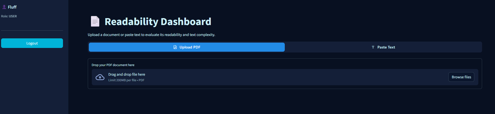
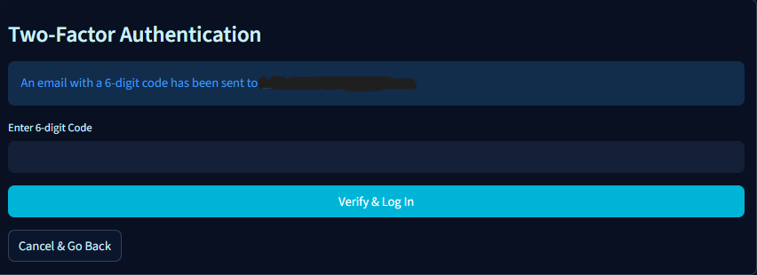
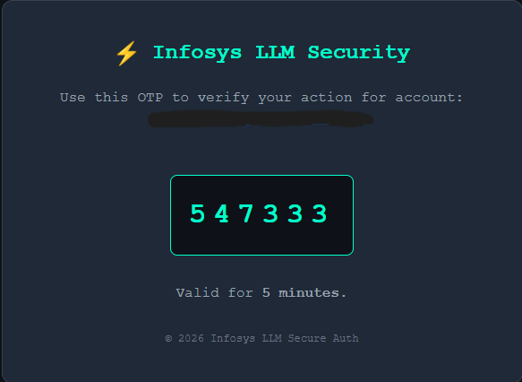

# Milestone 2 - Readability Analysis & Advanced Authentication

## Advanced Access Control & Linguistic Analysis

Secure Admin Routing, OTP Verification, and Text Analysis with Streamlit

## Description

In this milestone, we expanded the authentication system to include Role-Based Access Control (RBAC) and Two-Factor Authentication (2FA), while introducing a comprehensive Readability Dashboard. The application now supports distinct user and administrator roles, email-based OTP verification for secure logins and high-privilege actions, and a secure master admin bootstrap sequence. The core feature is the linguistic analysis tool, which processes raw text or PDF uploads to calculate readability scores, estimated reading times, and grade-level equivalents using industry-standard algorithms.

## Features Implemented

- **Readability Dashboard:** Evaluates text complexity utilizing Flesch Reading Ease, Flesch-Kincaid Grade, Gunning Fog, and SMOG Index metrics, complete with interactive Plotly visualizations.

- **Dual Input Modes:** Users can seamlessly switch between uploading PDF documents (parsed via PyPDF2) or pasting raw text for instant linguistic analysis.

- **Admin Dashboard:** A restricted interface for administrators to view the user directory, track recent logins, and manage system access.

- **Role-Based Access Control (RBAC):** Secure routing that separates standard users from administrative accounts based on database-level privileges.

- **OTP Authentication:** Email-based Two-Factor Authentication (2FA) via SMTP integrated into the login flow, password recovery wizard, and admin promotion processes.

- **Secure User Management:** Admins can permanently remove users utilizing a two-step visual confirmation system, or promote standard users to admins requiring OTP identity verification.

## Steps to Run the Application

### 1. Install Dependencies

Open your terminal and install the required Python libraries:

`pip install streamlit streamlit-antd-components pyjwt pyngrok PyPDF2 textstat plotly pandas`

### 2. Configure Environment Variables

Ensure your secure credentials are set in your environment before running (e.g., via Colab userdata or a local .env file):

- GMAIL\_USER: The sender email address for OTPs.

- GMAIL\_APP\_PASS: The secure app password for the sender email.

- JWT\_SECRET\_KEY: Your secure signing key for active sessions.

- SUPER\_ADMIN\_EMAIL: The designated email to automatically receive master admin privileges upon signup.

### 3. Run the Application

Navigate to the project directory and execute the Streamlit application:

`streamlit run app.py`

### 4. Expose via Ngrok (Optional)

To make the application accessible remotely, open a new terminal and run:

`ngrok http 8501`

## Screenshots

### User Readability Dashboard

### Admin Management Dashboard

### OTP Verification Flow

 

